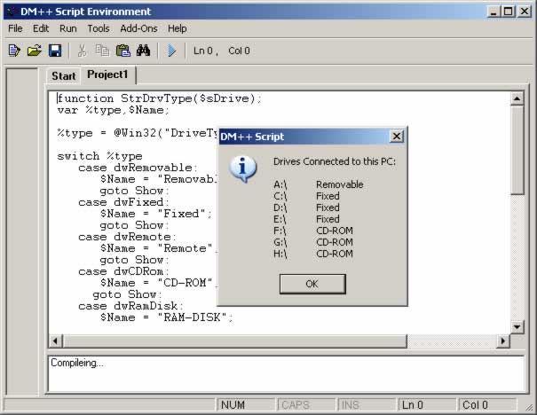



## DM\+\+ Script 5k Version 1

### Description

DM++ Scripting Language. Lots of Updates now has IF Statements, Switch statements, Goto, Goto Sub, For Loop,Arrays,Variables,Consts,Enums, Subs, Call Functions and Return from a function, Over 100 built in functions, FileIO support, Registry, INI File support, Use your own include modules. You can now also compile to an exe. Also quick user guide to help you get started.

Plus over 100 script Examples.

Note please read the Compile Help.doc if gives information on setting it up.

Please Vote.
 
### More Info
 

             |
---                |---
**Submitted On**   |2005-01-06 15:19:30
**By**             |[dreamvb](https://github.com/Planet-Source-Code/PSCIndex/blob/master/ByAuthor/dreamvb.md)
**Level**          |Advanced
**User Rating**    |5.0 (65 globes from 13 users)
**Compatibility**  |VB 6\.0
**Category**       |[Complete Applications](https://github.com/Planet-Source-Code/PSCIndex/blob/master/ByCategory/complete-applications__1-27.md)
**World**          |[Visual Basic](https://github.com/Planet-Source-Code/PSCIndex/blob/master/ByWorld/visual-basic.md)
**Archive File**   |[DM\+\+\_Scrip183733162005\.zip](https://github.com/Planet-Source-Code/dreamvb-dm-script-5k-version-1__1-58140/archive/master.zip)

